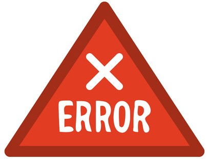
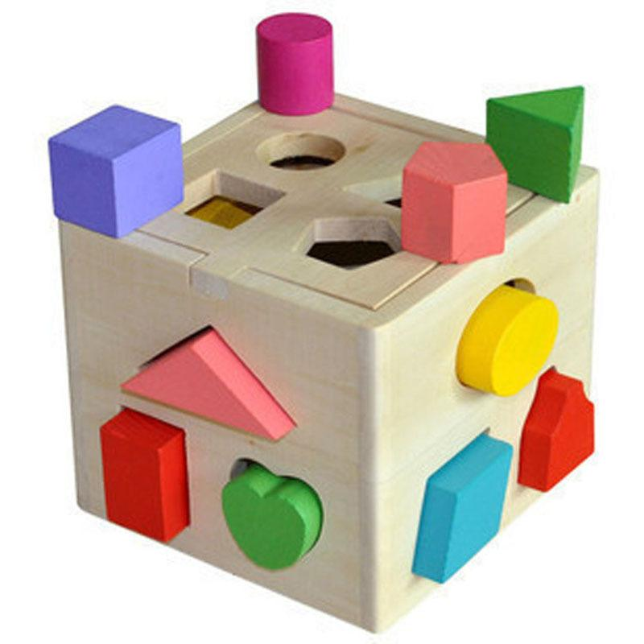
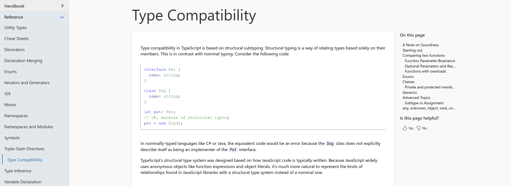
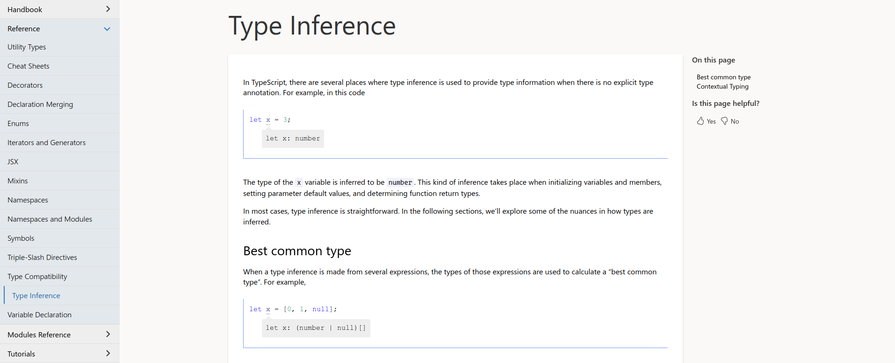
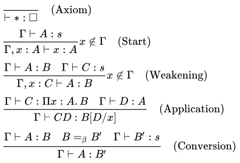
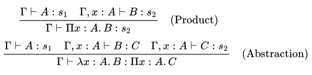
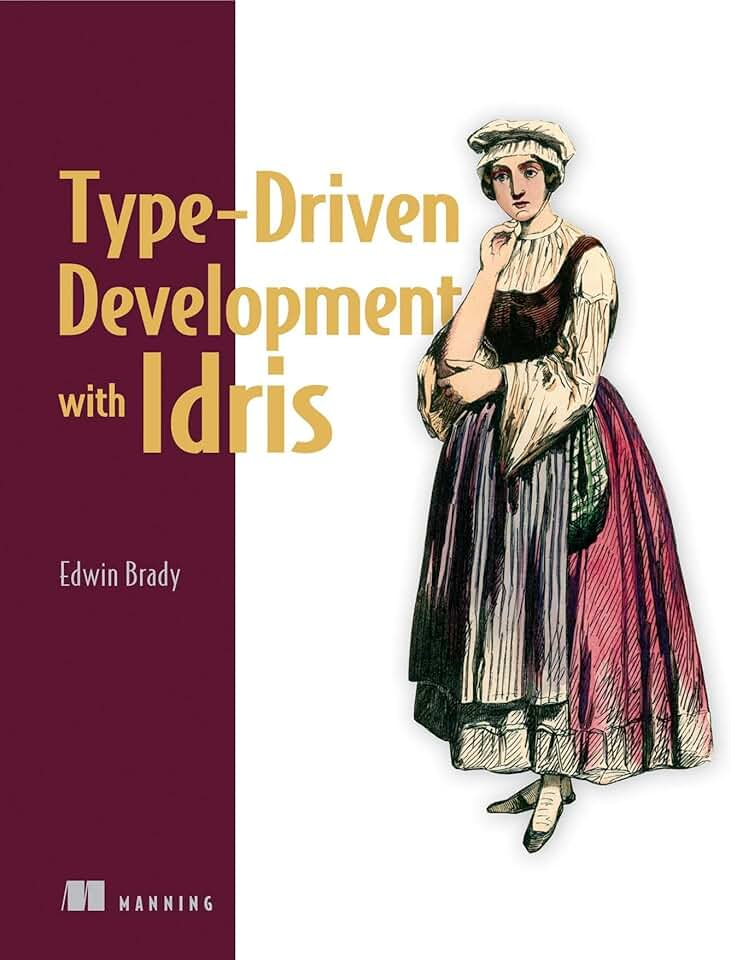

---
# You can also start simply with 'default'
theme: default
# some information about your slides (markdown enabled)
title: Ныряем в теорию типов для лучшего понимания языков программирования на примере TypeScript
drawings:
  persist: false
# enable MDC Syntax: https://sli.dev/features/mdc
mdc: true
fonts:
  sans: Roboto
layout: image
image: ./images/cover.png
---

---
layout: default
---

# Приятно познакомиться

<style>
  .two-cols-grid {
    align-items: center;
  }
</style>
<div class="two-cols-grid">
  <div class="two-cols-grid"><div><b>Василий Алфертьев</b></div></div>
  <div>
    
  </div>
  <div>
    <p> <b>Telegram</b>: <a href="https://t.me/alfertev2012">@alfertev2012</a></p>
    <p> <b>GitHub</b>: <a href="https://github.com/alfertev2014">alfertev2014</a></p>
  </div>
  <div>
    <div class="two-cols-grid">
      <div> React</div>
      <div> TypeScript</div>
    </div>
  </div>
</div>

---
layout: default
---

# Чем ещё владею

<style>
li {
  margin-block: 0;
}
</style>
<div class="two-cols-grid">

<div>

- 5+ лет в **С++**:
  - системное программирование
  - Linux
  - UI на Qt

</div>
<div>

- Увлекаюсь
  - **дизайном языков программирования**
  - best practices и архитектурой ПО
  - математической логикой

</div>
<div>

- ~6 лет в **Java**:
  - backend на Spring
  - базы данных
  - монолиты, микросервисы…

</div>
<div>

<ul>
<li><b v-mark.red>Фанат систем типов</b></li>
<li>Тянет разбираться в
  <ul>
  <li>компиляторах и оптимизациях</li>
  <li>"кишках" runtime разных языков</li>
  <li>IDE и инструментах</li>
  </ul>
</li>
</ul>
</div>
</div>

---
layout: default
dragPos:
  drag1: 176,124,365,_,-9
  drag2: 435,203,408,_,9
  drag3: 115,329,463,_,-11
  drag4: 118,244,571,_,10
  drag5: 553,55,320,_,-30
  drag6: 359,83,443,_,20
  drag7: 106,54,320,_,17
  drag8: 53,259,417,_,-28
  drag9: 363,420,211,_,28
  drag10: 482,327,320,_,-28
  drag11: 271,200,556,_,-22
  drag12: 380,228,320,_,20
  pepe: 198,116,512,_
---

<div v-drag="'drag1'" v-click><p style="font-size:2rem">Теория множеств</p></div>
<div v-drag="'drag2'" v-click><p style="font-size:2rem">Теория алгоритмов</p></div>
<div v-drag="'drag3'" v-click><p style="font-size:2rem">Теория доказательств</p></div>
<div v-drag="'drag4'" v-click><p style="font-size:2rem">Теория формальных языков</p></div>
<div v-drag="'drag5'" v-click><p>Синтаксический анализ</p></div>
<div v-drag="'drag6'" v-click><p>Абстрактное синтаксическое дерево</p></div>
<div v-drag="'drag7'" v-click><p style="font-size:1.5rem">Лямбда-исчисление</p></div>
<div v-drag="'drag8'" v-click><p style="font-size:1.5rem">Операционная семантика</p></div>
<div v-drag="'drag9'" v-click><p style="font-size:1.5rem">Лямбда-куб</p></div>
<div v-drag="'drag10'" v-click><p>Исчисление конструкций</p></div>
<div v-drag="'drag11'" v-click><p style="font-size:1.7rem">Интуиционистская математика</p></div>
<div v-drag="'drag12'" v-click><p>Соответствие Карри - Говарда</p></div>


---
layout: default
---

# Типы в языках программирования

<div class="two-cols-grid" style="grid-template-columns: 1fr 2fr">
<div>
  
</div>
<div>
<br />

- Безтиповые системы
- Простые типы
- Подтипы
- Рекурсивные типы
- Полиморфизм
- Системы высших порядков

</div>
</div>

---
layout: default
---

# План доклада

1. Дизайн языков программирования
1. Системы типов
1. Правила типизации
1. Влияние типизации на методологию разработки

---
layout: section
---

<h1><span class="number">1. </span>Дизайн языков программирования</h1>

---
layout: default
---

# Язык программирования

<style>
  .two-cols-grid > div {
    border: 2px solid #2d79c7;
    border-radius: 1rem;
    padding-left: 1rem;
  }
</style>
<div class="two-cols-grid" style="align-items: stretch">
<div>

**Синтаксис**

структура выражений

*(формальная грамматика)*

</div>
<div>

**Семантика**

смысл выражений

*(формальная спецификация)*

</div>
<div>

**Реализация**

компилятор или интерпретатор, среда исполнения

</div>
<div>

**Инструменты**

IDE, отладчики, профилировщики

</div>
</div>

---
layout: default
---

<style>
  .dimension {
    width: 12rem;
    .header {
      font-weight: 800;
      color: #2d79c7;
    }
    .description {
      font-size: 0.7rem;
      opacity: 0.7;
    }
  }
  .dimensions-grid {
    display: grid;
    grid-template-columns: 1fr 1fr 1fr;
    grid-template-rows: 6rem 1fr 6rem;
    align-items: center;
    width: 100%;
    column-gap: 1rem;
  }
</style>

<div class="dimensions-grid">
<div class="dimension">
<div class="header">Строгость</div><div class="description">статический отлов ошибок</div>
</div>
<div class="dimension">
<div class="header">Гибкость</div><div class="description">выразительность, свобода стиля кода</div>
</div>
<div class="dimension">
<div class="header">Понимаемость</div><div class="description">близость к предметной области</div>
</div>
<div class="dimension">
<div class="header">Поддержка IDE</div><div class="description">навигация по коду, автодополнение, рефакторинг</div>
</div>
<div>
  
</div>
<div class="dimension">
<div class="header">Производительность</div><div class="description">возможность автоматической оптимизации</div>
</div>
<div class="dimension">
<div class="header">Контроль</div><div class="description">прозрачность исполнения, отлаживаемость, возможность ручной оптимизации</div>
</div>
<div class="dimension">
<div class="header">Скорость сборки</div><div class="description">оптимизация CI-процессов</div>
</div>
<div class="dimension">
<div class="header">Модульность</div><div class="description">раздельная разработка, распространение в пакетах</div>
</div>
</div>

---
layout: default
---

# Общие черты языков программирования

- Элементарные типы данных и операции над ними
- Составные типы данных (объекты и массивы)
- Древовидные выражения
- Переменные с лексической областью видимости
- Функции и процедуры
- Замыкания
- Модули

---
layout: default
---

# Лямбда-исчисление

Теоретический каркас языков программирования

- Синтаксис:
  - Абстракция: `λ x . M`
  - Применение: `M N`
- Семантика:
  - "альфа-конверсия": `λ x . M` === `λ y . M` (с заменой `x` на `y`)
  - "бета-редукция": `(λ x . M) N` === `M` (с заменой `x` на `N`)

---
layout: default
---

<h1><span class="number">Ещё раз</span></h1>

- Язык программирования - спецификация, реализации и инструменты
- В дизайне языка много компромиссов
- Система типов влияет на все факторы
- Разные языки имеют общую теорию

---
layout: section
---

<h1><span class="number">2. </span>Системы типов</h1>

---
layout: default
---

# Ошибки

<div class="two-cols-grid">
<div>

- Синтаксические ошибки
- Ошибки времени исполнения
  - Ошибки среды исполнения
  - Необработанные исключения
  - stack overflow, out of memory, зацикливания
  - Логические ошибки

</div>
<div>
  
</div>
</div>

---
layout: default
---

# TypeError

[https://developer.mozilla.org/en-US/docs/Web/JavaScript/Reference/Global_Objects/TypeError]

A `TypeError` may be thrown when:

- an operand or argument passed to a function is incompatible with the type expected by that operator or function; or
- when attempting to modify a value that cannot be changed; or
- when attempting to use a value in an inappropriate way.

---
layout: default
---

# Статический анализ

<div class="two-cols-grid" style="grid-template-columns: 2fr 3fr">
<div>
  
</div>
<div>
<br />

- Рассуждения об исполнении программы без её реального запуска
- Опирается только на код программы и спецификацию языка
- Обнаружение потенциальных ошибок или **доказательство** их отсутствия

</div>
</div>

---
layout: default
---

# Система типов

<div class="two-cols-grid" style="grid-template-columns: 2fr 1fr">
<div>

- Система доказательства утверждений о типах выражений
- Опирается на семантику языка
- Является "упрощённой версией" (проекцией) семантики

Предназначена для доказательства *отсутствия* определённого рода ошибок при исполнении программы - **ошибок типизации**.

</div>
<div>
  
</div>
</div>

---
layout: default
---

# Раскладка данных в памяти

Например, как структуры в языках C и C++

```c
struct S {
  int a;
  bool b;
  const char* c;
  unsigned char d[4];
  // ...
};
```

---
layout: default
---

# Типы

- Сущности времени компиляции
- Утверждения о поведении программы для выражений в коде
- В частности:
  - **Множества  допустимых значений для выражений**

---
layout: default
---

# Примеры типов TypeScript

````md magic-move
```ts
// Простые типы
const a1: number    = 42               // число
const a2: string    = "The Answer"     // строка
const a3: boolean    = false           // логическое

// Составные типы
const a4: number[]    = [1, 2, 3]                             // массив
const a5: { foo: number; bar: boolean; baz: string } =        // объект
  { foo: 42, bar: false, baz: "The Answer"}
const a6: [number, string]    = [42, "The Answer"]            // кортеж

// Функциональные типы
const a7: () => void                  = () => { /* do nothing */}
const a8: (arg1: string) => number    = (arg1: string) => parseInt(arg1, 10)
```
```ts
// Литеральные типы
const a9: 42   = 42
const a10: "The Answer"   = "The Answer"
const a11: false   = false
const a12: null   = null
const a13: undefined   = undefined

// Типы-объединения
const a14:  4 | 8 | 15 | 16 | 23 | 42   = 42
const a15:  "red" | "green" | "blue" | undefined    = "green"
const a15: { foo: number; bar: boolean; baz: string } | null   = null

// Типы пересечения
const a16: { foo: number; } & { bar: boolean; baz: string } =
  { foo: 42, bar: false, baz: "The Answer"}
```
```ts
const a17: unknown   = { /* Буквально всё, что угодно */ }
const a18: never   = throw new Exception("Никакого значения результата")

const a19: any   = "😤";  // Не используйте его, пожалуйста! ;)

const a20: void    = (() => { /* ... */})()  // Значение не будет использовано
```
````

---
layout: default
---

# Проверка типов

<div class="two-cols-grid">
<div>

```ts {all|5,10}{at:1}
const b: B = {
  foo: "the Answer",
  bar: 42
}
const a: A = b

let m: A = {
  foo: "the Question"
}
m = b
```

</div>
<div>

```ts {all|6,10}{at:1}
type C = {
  a: A
}

const c: C = { a: a }
c.a = b

const f = (a: A) => { }

f(b);
```

</div>
</div>

---
layout: default
---

# Type Compatibility

[https://www.typescriptlang.org/docs/handbook/type-compatibility.html]




---
layout: default
---

# Вывод типов

- Реконструкция отсутствующих аннотаций типов
- Выполняется на основе правил типизации
- Исходные данные:
  - Типы литеральные выражений и встроенных операций
  - Явные аннотации типов

---
layout: default
---

# Вывод типов

````md magic-move
```ts
const a = 42

const b = "The Answer"

const c = b + " is " + a

const d =
  (s: string, n: number) => s.length === n * a

const e = d(b, a)
```
```ts
const a/*: ???*/ = 42

const b/*: ???*/ = "The Answer"

const c/*: ???*/ = b + " is " + a

const d/*: ???*/ =
  (s: string, n: number)/*: ???*/ => s.length === n * a

const e/*: ???*/ = d(b, a)
```
```ts {1}
const a: 42    = 42

const b/*: ???*/ = "The Answer"

const c/*: ???*/ = b + " is " + a

const d/*: ???*/ =
  (s: string, n: number)/*: ???*/ => s.length === n * a

const e/*: ???*/ = d(b, a)
```
```ts {3}
const a: 42    = 42

const b: "The Answer"   = "The Answer"

const c/*: ???*/ = b + " is " + a

const d/*: ???*/ =
  (s: string, n: number)/*: ???*/ => s.length === n * a

const e/*: ???*/ = d(b, a)
```
```ts {5}
const a: 42    = 42

const b: "The Answer"   = "The Answer"

const c: string   = b + " is " + a

const d/*: ???*/ =
  (s: string, n: number)/*: ???*/ => s.length === n * a

const e/*: ???*/ = d(b, a)
```
```ts {8}
const a: 42    = 42

const b: "The Answer"   = "The Answer"

const c: string   = b + " is " + a

const d/*: ???*/ =
  (s: string, n: number): boolean => s.length === n * a

const e/*: ???*/ = d(b, a)
```
```ts {7}
const a: 42    = 42

const b: "The Answer"   = "The Answer"

const c: string   = b + " is " + a

const d: (s: string, n: number) => boolean   =
  (s: string, n: number): boolean => s.length === n * a

const e/*: ???*/ = d(b, a)
```
```ts {10}
const a: 42    = 42

const b: "The Answer"   = "The Answer"

const c: string   = b + " is " + a

const d: (s: string, n: number) => boolean   =
  (s: string, n: number): boolean => s.length === n * a

const e: boolean   = d(b, a)
```
````

---
layout: default
---

# Type Inference

[https://www.typescriptlang.org/docs/handbook/type-inference.html]



---
layout: default
---

# Свойства систем типов

- **Надёжность** (soundness)
- **Полнота** (completeness)
- **Разрешимость** (resolvability)
- и другие

---
layout: default
---

# Надёжность системы типов

<div>

Система типов **надёжна** (*sound*), если выведенные типы **_гарантированно_** соответствуют семантике (поведению в runtime).

</div>


---
layout: default
---

# Пример ненадёжности TypeScript

```ts {all|1,2|4,5|7|9}
type A = { prop: string | boolean }
type B = { prop: string }

const b: B = { prop: "foo" }
const a: A = b

a.prop = true

console.log("b.prop", b.prop.toUpperCase())
```

<div v-click="4" class="slidev-code error-output">
TypeError: b.prop.toUpperCase is not a function
</div>

---
layout: image
image: ./images/nenastoyashiy.jpg
backgroundSize: contain
---


---
layout: default
---

# Надёжность системы типов TypeScript

[https://github.com/Microsoft/TypeScript/wiki/TypeScript-Design-Goals]

**Non-goals:**

- Apply a **sound** or "**provably correct**" type system. Instead, strike a balance between correctness and productivity.

---
layout: default
---

<style scoped>
  p {
    background-color: #ffffff;
  }
</style>

# И как с этим жить?


<br />
<div style="text-align: center; font-size: 1.5rem">
<v-clicks>

Мы **_хотим_**, чтобы типы в коде были верными

*Ответственность ложится на разработчика*

Type checker - просто инструмент

Для гарантий нужны **_best practices_** и **_соглашения_**

</v-clicks>
</div>

---
layout: default
dragPos:
  first_time: 262,29,404,_
  cpp: 442,272,54,_
---


<div v-drag="'cpp'" style="background-color: white;text-align: center">
<b>C++</b>
</div>

---
layout: default
---

<h1><span class="number">Ещё раз</span></h1>

- Статический анализ - проверка программы по её коду без исполнения
- Типы - множества допустимых значений
- Система типов - предотвращение ошибок типизации
- Надёжность системы типов - гарантии достоверности типов
- При ненадёжной системе типов нужны best practices и дисциплина кода

---
layout: section
---

<h1><span class="number">3. </span>Правила типизации</h1>

---
layout: default
---

# Правила типизации

- Правила "приписывания" типов выражениям
- Не должны противоречить правилам семантики
- Используются
  - в алгоритмах проверки и вывода типов
  - в IDE (навигация по коду, автодополнение, рефакторинг)
  - компилятором для оптимизаций и раскладки данных в памяти

---
layout: default
dragPos:
  typing_rules: 64,117,377,_
  typing_rules2: 466,152,465,_
  pepe: 217,123,540,_
---

# Правила типизации





---
layout: default
---

# Структура правил

<br />
<div class="text-center">

```text
Предпосылки
 ----------- 
Следствие
```

</div>

**Предпосылки** - предусловия для применения правила.

**Следствие** - высказывание о типизации, когда верны все предпосылки.

---
layout: default
---

# Контекст типизации

Высказывания о типизации переменных и констант в текущей лексической области видимости

<div class="text-center">

```text
Г |- <высказывания типизации в контексте Г>
```

где Г - список пар (имя: Т  ип)

</div>

---
layout: default
---

# Литеральные выражения

<br />
<div class="text-center">

```text
|- m - литерал типа T
 -------------------------- 
|- m: T
```

Литералу соответствует его собственный тип.

</div>

---
layout: default
---

# Литеральные выражения

````md magic-move
```ts
42            // number
100500.5      // number
"The Answer"  // string
true          // boolean
false         // boolean
```
```ts
let a1 = 42            // number
let a2 = 100500.5      // number
let a3 = "The Answer"  // string
let a4 = true          // boolean
let a5 = false         // boolean
```
```ts
const a1 = 42            // 42
const a2 = 100500.5      // 100500.5
const a3 = "The Answer"  // "The Answer"
const a4 = true          // true
const a5 = false         // false
```
```ts
const a1 = 42            // 42
const a2 = 100500.5      // 100500.5
const a3 = "The Answer"  // "The Answer"
const a4 = true          // true
const a5 = false         // false

const a6 = null          // null
const a7 = undefined     // undefined
```
````

<v-click at="2">

Если данные неизменны, то литералу соответствует Unit-тип.

</v-click>

---
layout: default
---

# Аннотации типов

<div class="text-center">

```text

 ------------------ 
Г |- (m as T): T
```

</div>

Если к выражению прямо в коде приписан тип, то верим написанному

---
layout: default
---

# Аннотации типов

````md magic-move
```ts
const f =
  (arg: string) => {
    const arr = arg.split(' ');
    return arr.length
  }
```
```ts
const f: (arg: string) => number   =
  (arg: string): number => {
    const arr: string[] = arg.split(' ');
    return arr.length
  }
```
```ts {3}
const f: (arg: string) => number   =
  (arg: string): number => {
    const arr: string[] = (   arg as string   ).split(' ');
    return arr.length
  }
```
```ts {3}
const f: (arg: string) => number   =
  (arg: string): number => {
    const arr: string[] = (   arg.split as (sep: string) => string[]   )(' ');
    return arr.length
  }
```
```ts {4}
const f: (arg: string) => number   =
  (arg: string): number => {
    const arr: string[] = arg.split(' ');
    return    arr.length as number
  }
```
````

---
layout: default
---

# Составные типы

- Кортежи:

<div class="text-center">

```text
Г |- a1: T1, a2: T2, a3: T3, ...
 ------------------------------------------ 
Г |- [a1, a2, a3, ...]: [T1, T2, T3, ...]
```

</div>

- Объекты:

<div class="text-center">

```text
Г |- a1: T1, a2: T2, a3: T3, ...
 -------------------------------------------------------------------- 
Г |- { p1: a1, p2: a2, p3: a3, ...}: { p1: T1, p2: T2, p3: T3, ...}
```

</div>

---
layout: default
---

# Составные типы

````md magic-move
```ts
let a1 = []            // never[]
let a2 = {}            // {}
let a3 = () => {}      // () => void
```
```ts
let a1 = [42, 100500.5]                  // number[]
let a2 = { a: "The Answer", b: false }   // { a: string, b: boolean }
let a3 = (arg: string): number => {
  return arg.length
}                                        // (arg: string) => number
```
```ts
const a1 = [42, 100500.5] as const                  // readonly [42, 100500.5]
const a2 = { a: "The Answer", b: false } as const
// { readonly a: string, readonly b: boolean }

const a3 = (arg: string): number => {
  return arg.length
}                                                   // (arg: string) => number
```
````

---
layout: default
---

# Функциональные типы

````md magic-move
```ts
const f = (arg1: string, arg2: number) => arg1.length === arg2

const res = f("fooBar", 6)
```
```ts {1,4}
const f: (arg1: string, arg2: number) => boolean  =
  (arg1: string, arg2: number) => arg1.length === arg2

const res: boolean  =
  f("fooBar", 6)
```
````

<v-click at="1">

- Тип лямбда-выражения = (...типы аргументов) => выведенный тип результата
- Тип вызова функции равен типу результата функции

</v-click>

---
layout: default
---

# Система типов с простыми типами

- Типы считаются совместимыми, если они полностью идентичны
- Различающиеся типы несовместимы

```ts twoslash
const a: string = 42

const f = (arg: number)=> { }

f(a)
```

---
layout: default
---

# Полиморфизм

- Один и тот же код может работать со значениями разных типов

Виды полиморфизма:

- Отношение подтипов (**Subtyping**)
- Параметрический полиморфизм (**Generics**)
- **Ad-hoc** полиморфизм

А также, бывает *статический* и *динамический*.

---
layout: default
---

# Отношение подтипов (<:)

- "Полиморфизм для бедных"
- Похоже на отношение вложения множеств
- Правило совместимости типов:

<div class="text-center">

```text
Актуальный тип <: Ожидаемый тип
```

</div>

---
layout: default
---


---
layout: section
---

<h1><span class="number">4. </span>Влияние типизации на методологию разработки</h1>

---
layout: default
class: text-center
---

Нельзя так просто взять и


переписать проект на более строгом языке

---
layout: default
---

# Перефразируя Дональда Кнута

<br />
<div style="display: flex; flex-flow: row nowrap; justify-content: space-between; align-items: center">
<div>

Преждевременная...

</div>
<div>
<v-clicks>

оптимизация

универсализация

типизация

</v-clicks>
</div>
<div>
<p>- корень всех зол.</p>
</div>
</div>

---
layout: default
---

# "Сверху вниз" vs. "Снизу вверх"

<br />
<div class="two-cols-grid">
<div>

<p class="text-center"><b>⬇️ Подход "Сверху вниз"</b></p>

Сначала делаем общую структуру, а потом постепенно доделываем детали.

</div>
<div>

<p class="text-center"><b>⬆️ Подход "Снизу вверх":</b></p>

Сначала хорошо отлаживаем детали, а потом постепенно собираем из них

</div>
</div>


---
layout: default
---

# Type Driven Development

<div class="two-cols-grid" style="grid-template-columns: 2fr 1fr">
<div>
<br />

Цикл из трёх фаз:

- Type
- Define
- Refine

</div>
<div>
  
</div>
</div>

---
layout: default
---

# Type Driven Development

1. **Type**
    - Написать желаемый тип интерфейса/сигнатуры, опираясь на требования
2. **Define**
    - Написать минимальную реализацию, соответствующую типу
3. **Refine**
    - Доуточнить тип, сделать более строгим

*Повторить цикл с п. 1*

---
layout: default
---

# Test Driven Development

1. **Красный тест**
    - Написать один минимальный падающий тест, опираясь на требования
2. **Зелёный тест**
    - Написать минимальные изменения, чтобы сделать тест зелёным
3. **Рефакторинг**
    - Порефакторить, опираясь на здравый смысл

*Повторить цикл с п. 1*

---
layout: default
---

<h1><span class="number">Другими словами</span></h1>

- Разработка с типами - другой подход и другой стиль кода

---
layout: section
---

# Заключение

---
layout: default
---

# Заключение

- Система типов помогает отловить определённые ошибки статически
- За системой типов стоит сложная и интересная математика
- Система типов бывает достаточно гибкой для полиморфизма и написания спецификаций
- Ненадёжная система типов требует повышенного внимания и дисциплины кода
- С типизацией изменяется подход к написанию кода и стиль кода

---
layout: image
image: ./images/contacts.png
---
