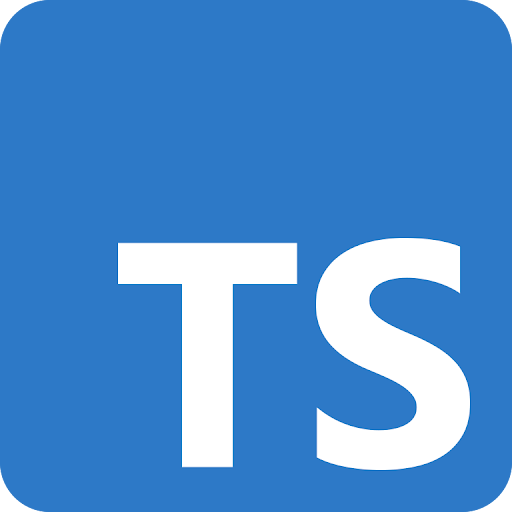

---
# You can also start simply with 'default'
theme: default
# some information about your slides (markdown enabled)
title: Ныряем в теорию типов для лучшего понимания языков программирования на примере TypeScript
info: |
  ## Slidev Starter Template
  Presentation slides for developers.

  Learn more at [Sli.dev](https://sli.dev)
# apply unocss classes to the current slide
class: text-center
# https://sli.dev/features/drawing
drawings:
  persist: false
# enable MDC Syntax: https://sli.dev/features/mdc
mdc: true
fonts:
  sans: Roboto
---

# Ныряем в теорию типов

для лучшего понимания языков программирования на примере TypeScript

---
layout: default
---

# Приятно познакомиться

<style>
  .two-cols-grid {
    align-items: center;
  }
</style>
<div class="two-cols-grid">
  <div class="two-cols-grid"><div><b>Василий Алфертьев</b></div></div>
  <div>
    
  </div>
  <div>
    <p> <b>Telegram</b>: <a href="https://t.me/alfertev2012">@alfertev2012</a></p>
    <p> <b>GitHub</b>: <a href="https://github.com/alfertev2014">alfertev2014</a></p>
  </div>
  <div>
    <div class="two-cols-grid">
      <div> React</div>
      <div> TypeScript</div>
    </div>
  </div>
</div>

---
layout: default
---

# Чем ещё владею

<style>
li {
  margin-block: 0;
}
</style>
<div class="two-cols-grid">

<div>

- 5+ лет в **С++**:
  - системное программирование
  - Linux
  - UI на Qt

</div>
<div>

- Увлекаюсь
  - **дизайном языков программирования**
  - best practices и архитектурой ПО
  - математической логикой

</div>
<div>

- ~6 лет в **Java**:
  - backend на Spring
  - базы данных
  - монолиты, микросервисы…

</div>
<div>

<ul>
<li><b v-mark.red>Фанат систем типов</b></li>
<li>Тянет разбираться в
  <ul>
  <li>компиляторах и оптимизациях</li>
  <li>"кишках" runtime разных языков</li>
  <li>IDE и инструментах</li>
  </ul>
</li>
</ul>
</div>
</div>

---
layout: default
dragPos:
  drag1: 176,124,365,_,-9
  drag2: 435,203,408,_,9
  drag3: 115,329,463,_,-11
  drag4: 118,244,571,_,10
  drag5: 553,55,320,_,-30
  drag6: 359,83,443,_,20
  drag7: 106,54,320,_,17
  drag8: 53,259,417,_,-28
  drag9: 363,420,211,_,28
  drag10: 482,327,320,_,-28
  drag11: 271,200,556,_,-22
  drag12: 380,228,320,_,20
  pepe: 198,116,512,_
---

<div v-drag="'drag1'" v-click><p style="font-size:2rem">Теория множеств</p></div>
<div v-drag="'drag2'" v-click><p style="font-size:2rem">Теория алгоритмов</p></div>
<div v-drag="'drag3'" v-click><p style="font-size:2rem">Теория доказательств</p></div>
<div v-drag="'drag4'" v-click><p style="font-size:2rem">Теория формальных языков</p></div>
<div v-drag="'drag5'" v-click><p>Синтаксический анализ</p></div>
<div v-drag="'drag6'" v-click><p>Абстрактное синтаксическое дерево</p></div>
<div v-drag="'drag7'" v-click><p style="font-size:1.5rem">Лямбда-исчисление</p></div>
<div v-drag="'drag8'" v-click><p style="font-size:1.5rem">Операционная семантика</p></div>
<div v-drag="'drag9'" v-click><p style="font-size:1.5rem">Лямбда-куб</p></div>
<div v-drag="'drag10'" v-click><p>Исчисление конструкций</p></div>
<div v-drag="'drag11'" v-click><p style="font-size:1.7rem">Интуиционистская математика</p></div>
<div v-drag="'drag12'" v-click><p>Соответствие Карри - Говарда</p></div>


---
layout: default
---

# Теория

<div class="two-cols-grid" style="grid-template-columns: 2fr 1fr">
<div>

- Теория множеств
- Теория доказательств
- Теория формальных языков и грамматик
- Лямбда-исчисление
- Операционная семантика

</div>
<div>
  
</div>
</div>

---
layout: default
---

# План доклада

1. Дизайн языков программирования
1. Дизайн систем типов
1. Правила типизации
1. Влияние на методологию

---
layout: default
---

# 1. Дизайн языков программирования

- 1.1. Синтаксис, cемантика и реализации языка
- 1.2. Факторы и компромисы
- 1.3. Роль системы типов в дизайне языка
- 1.4. Типовые черты языков
- 1.5. Лямбда-исчисление как теоретический каркас

---
layout: section
---

# 1.1. Синтаксис, cемантика и реализации языка

---
layout: default
---

# Язык программирования

- **Синтаксис** - правила построения *выражений*
- **Семантика** - правила определения *смысла* выражений (или исполнения программы)
- **Реализация**

---
layout: image
image: ./images/ecmascript_spec.png
---

---
layout: default
---

# Реализация и инструменты


---
layout: default
---

# TypeScript и Node.js


<br />

- или использовать `tsx` (или аналоги)
- или запускать `*.ts` нативно на `Node.js`

---
layout: section
---

# 1.2. Факторы и компромисы

---
layout: default
---

# Требования к языку программирования

- Строгость (статический отлов ошибок)
- Гибкость (выразительность, свобода стиля кода)
- Поддержка IDE (навигация по коду, автодополнение, рефакторинг)
- Производительность (возможность автоматической оптимизации)
- Контроль (прозрачность, отлаживаемость, возможность ручной оптимизации)
- Модульность (раздельная разработка, распространение в пакетах)
- Понимаемость (близость к предметной области)
- Скорость сборки

---
layout: section
---

# 1.3. Роль системы типов в дизайне языка

---
layout: section
---

# 1.4. Типовые черты языков

---
layout: default
---

# Общие черты языков программирования

- Базовые типы данных и операции над ними
- Составные типы данных (объекты и массивы)
- Древовидные выражения
- Переменные с лексической областью видимости
- Функции и процедуры
- Замыкания
- Модули

---
layout: section
---

# 1.5. Лямбда-исчисление как теоретический каркас

---
layout: default
---

# Лямбда-исчисление

- Теоретический каркас языков программирования
- Выражения:
  - Абстракция: `λ x . M`
  - Применение: `M N`
- Правила:
  - "альфа-конверсия": `λ x . M` === `λ y . M` (с заменой `x` на `y`)
  - "бета-редукция": `(λ x . M) N` === `M` (с заменой `x` на `N`)

---
layout: default
---

# Ещё раз

- Спецификация языка - синтаксис и семантика
- Язык может иметь множество реализаций по спецификации
- Большинство языков строятся на основе лямбда-исчисления

---
layout: default
---

# 2. Дизайн систем типов

- 2.1. Статический анализ
- 2.2. Что такое типы
- 2.3. Система типов
- 2.4. Надёжность системы типов

---
layout: section
---

# 2.1. Статический анализ

---
layout: default
---

# Ошибки

<div class="two-cols-grid">
<div>

- Синтаксические ошибки
- Ошибки времени исполнения
  - Ошибки среды исполнения
  - Необработанные исключения
  - stack overflow, out of memory, зацикливания
  - Логические ошибки

</div>
<div>
  
</div>
</div>

---
layout: default
---

# TypeError

[https://developer.mozilla.org/en-US/docs/Web/JavaScript/Reference/Global_Objects/TypeError]

A `TypeError` may be thrown when:

- an operand or argument passed to a function is incompatible with the type expected by that operator or function; or
- when attempting to modify a value that cannot be changed; or
- when attempting to use a value in an inappropriate way.

---
layout: default
---

# Статический анализ

- Рассуждения об исполнении программы без её реального запуска
- Доказательство свойств программ
  - Обнаружение потенциальных ошибок или **доказательство** их отсутствия

---
layout: default
---

# Формальная верификация


---
layout: section
---

# 2.2. Что такое типы

---
layout: default
---

# Типы как раскладка данных в памяти

Например, как структуры в языках C и C++

```c
struct S {
  int a;
  bool b;
  const char* c;
  unsigned char d[4];
  // ...
};
```

---
layout: default
---

# Что такое типы

- Типы - это утверждения о выражениях в коде
  - В частности: **тип - это множество допустимых значений выражения**

---
layout: section
---

# 2.3. Система типов

---
layout: default
---

# Система типов

- Система доказательства подмножества (ослабленных) утверждений
- Исходит из семантики языка
- Является "упрощённой версией" (проекцией) семантики

Система типов предназначена для доказательства *отсутствия* определённого рода ошибок при исполнении программы - **ошибок типизации**.

---
layout: section
---

# 2.4. Надёжность системы типов

---
layout: default
---

# Свойства систем типов

- **Надёжность** (soundness)
- **Полнота** (completeness)
- **Разрешимость** (resolvability)

---
layout: default
---

# Надёжность системы типов

<br />

Система типов **надёжна** (*sound*), если выведенные типы **_гарантированно_** соответствуют семантике (поведению в runtime).

*Вычисление корректно типизированного выражения либо зациклится, либо гарантированно даст в результате значение, удовлетворяющее выведенному типу.*

---
layout: default
---

# Пример ненадёжности TypeScript

```ts
type A = { a: string | boolean }
type B = { a: string }

const b: B = { a: "foo" }
const a: A = b
a.a = true
console.log("b.a", b.a.toUpperCase())
```

<v-click>

```
TypeError: b.a.toUpperCase is not a function
```

</v-click>

---
layout: default
---

# Надёжность системы типов TypeScript

[https://github.com/Microsoft/TypeScript/wiki/TypeScript-Design-Goals]

- **Non-goals**:
  - Apply a **sound** or "**provably correct**" type system. Instead, strike a balance between correctness and productivity.

---
layout: default
---


---
layout: default
---

<style scoped>
  p {
    background-color: #ffffff;
  }
</style>

# И как с этим жить?


<br />
<div style="text-align: center; font-size: 1.5rem">
<v-clicks>

Мы **_хотим_**, чтобы типы в коде были верными

*Ответственность ложится на разработчика*

Type checker - просто инструмент

Для гарантий нужны **_best practices_** и **_соглашения_**

</v-clicks>
</div>

---
layout: default
dragPos:
  first_time: 262,29,404,_
  cpp: 442,272,54,_
---


<div v-drag="'cpp'" style="background-color: white;text-alignment: center">
<b>C++</b>
</div>

---
layout: default
---

# Ещё раз

- Программы семантически некорректны, если приводят к ошибкам при исполнении
- Статический анализ - проверка и поиск ошибок до исполнения по спецификации
- Типы - множества допустимых значений
- Система типов - предотвращение ошибок типизации
- Надёжность - гарантии верности типов

---
layout: section
---

# 3. Правила типизации

---
layout: default
---

# Правила типизации

- Правила "приписывания" типов выражениям
- Не должны противоречить семантике
- Используются в алгоритмах проверки и вывода типов
- Используются в IDE (навигация по коду, автодополнение, рефакторинг)
- Используются компилятором для структур данных в памяти и оптимизаций

---
layout: default
dragPos:
  typing_rules: 64,117,377,_
  typing_rules2: 466,152,465,_
---

# Правила типизации


---
layout: image
image: /images/pepe.png
---

---
layout: default
---

# Структура правил

```text
Предусловия
-----------
Следствие
```

---
layout: default
---

# Литеральные выражения

````md magic-move
```ts
42            // number
100500.5      // number
"The Answer"  // string
true          // boolean
false         // boolean
```
```ts
let a1 = 42            // number
let a2 = 100500.5      // number
let a3 = "The Answer"  // string
let a4 = true          // boolean
let a5 = false         // boolean
```
```ts
const a1 = 42            // 42
const a2 = 100500.5      // 100500.5
const a3 = "The Answer"  // "The Answer"
const a4 = true          // true
const a5 = false         // false
```

```ts
const a1 = 42            // 42
const a2 = 100500.5      // 100500.5
const a3 = "The Answer"  // "The Answer"
const a4 = true          // true
const a5 = false         // false

const a6 = null          // null
const a7 = undefined     // undefined
```
````

Литералу соответствует его собственный тип.

<v-click at="2">

Если данные неизменны, то литералу соответствует Unit-тип.

</v-click>

---
layout: default
---

# Составные типы

````md magic-move
```ts
let a1 = []            // never[]
let a2 = {}            // {}
let a3 = () => {}      // () => void
```
```ts
let a1 = [42, 100500.5]                  // number[]
let a2 = { a: "The Answer", b: false }   // { a: string, b: boolean }
let a3 = (arg: string): number => {
  return arg.length
}                                        // (arg: string) => number
```
```ts
const a1 = [42, 100500.5] as const                  // readonly [42, 100500.5]
const a2 = { a: "The Answer", b: false } as const
// { readonly a: string, readonly b: boolean }

const a3 = (arg: string): number => {
  return arg.length
}                                                   // (arg: string) => number
```
````

Составной тип зависит от типов своих составляющих.

---
layout: default
---

# Аннотации типов

````md magic-move
```ts
const f = (arg: string) => {
  const arr = arg.split(' ');
  return arr.length
}
```
```ts
const f: (arg: string) => number   =  (arg: string): number => {
  const arr: string[] = arg.split(' ');
  return arr.length
}
```
```ts {2}
const f: (arg: string) => number   =  (arg: string): number => {
  const arr: string[] = (arg as string).split(' ');
  return arr.length
}
```
```ts {2}
const f: (arg: string) => number   =  (arg: string): number => {
  const arr: string[] = (arg.split as (sep: string) => string[])(' ');
  return arr.length
}
```
```ts {3}
const f: (arg: string) => number   =  (arg: string): number => {
  const arr: string[] = arg.split(' ');
  return arr.length as number
}
```
```ts {2,3}
const f: (arg: string) => number   =  (arg: string): number => {
  const arr: string[] = (arg.split satisfies (sep: string) => string[])(" ");
  return arr.length satisfies number
}
```
````

---
layout: default
---

# Функциональные типы

````md magic-move
```ts
const f = (arg1: string, arg2: number) => arg1.length === arg2

const res = f("fooBar", 6)
```
```ts {1,4}
const f: (arg1: string, arg2: number) => boolean  =
  (arg1: string, arg2: number) => arg1.length === arg2

const res: boolean  =
  f("fooBar", 6)
```
````

<v-click at="1">

- Тип лямбда-выражения = (...типы аргументов) => выведенный тип результата
- Тип вызова функции равен типу результата функции

</v-click>

---
layout: default
---

# Проверка типов

- Проверка выражений на соответствие правилам типизации
- Проверка совместимости типов при
  - инициализации
  - присваивании
  - передаче аргументов в функцию

---
layout: default
---

# Проверка типов

```ts twoslash
const a: string = 42;        // Инициализация

let b: boolean = false
b = null                     // Присваивание
```

---
layout: default
---

# Проверка типов

```ts twoslash
const c: { prop: string } = { prop: 42}   // Ожидаемый тип объекта

c.prop = false             // Присваивание property

const f = (arg: string) => { }
f(42)                   // Передача аргумента в функкцию
```

---
layout: default
---

# Type Compatibility

[https://www.typescriptlang.org/docs/handbook/type-compatibility.html]


---
layout: default
---

# Вывод типов

- Реконструкция отсутствующих аннотаций типов
- Выполняется на основе правил типизации
- Исходные данные:
  - Типы литеральные выражений и встроенных операций
  - Явные аннотации типов

---
layout: default
---

# Вывод типов

````md magic-move
```ts
const a = 42

const b = "The Answer to Life the Universe and Everything"

const c = b + " is " + a

const d = (s: string, n: number) => s.length === n

const e = d(b, a)
```
```ts
const a/*: ???*/ = 42

const b/*: ???*/ = "The Answer to Life the Universe and Everything"

const c/*: ???*/ = b + " is " + a

const d/*: ???*/ = (s: string, n: number)/*: ???*/ => s.length === n

const e/*: ???*/ = d(b, a)
```
```ts
const a: 42                                 = 42

const b: "The Answer to Life the Universe and Everything" =
  "The Answer to Life the Universe and Everything"

const c: string                             = b + " is " + a

const d: (s: string, n: number) => boolean  =
  (s: string, n: number): boolean => s.length === n

const e: boolean                            = d(b, a)
```
```ts {9}
const a: 42                                 = 42

const b: "The Answer to Life the Universe and Everything" =
  "The Answer to Life the Universe and Everything"

const c: string                             = b + " is " + a

const d: (s: string, n: number) => boolean  =
  (s, n) => s.length === n

const e: boolean                            = d(b, a)
```
````

---
layout: default
---

# Type Inference

[https://www.typescriptlang.org/docs/handbook/type-inference.html]


---
layout: default
---

# Система типов с простыми типами

- Типы считаются совместимыми, если они полностью идентичны
- Различающиеся типы несовместимы

```ts twoslash
const a: string = 42

const f = (arg: number)=> { }

f(a)
```

---
layout: default
---

# Полиморфизм

- Один и тот же код может работать со значениями разных типов

Виды полиморфизма:

- Отношение подтипов (**Subtyping**)
- Параметрический полиморфизм (**Generics**)
- **Ad-hoc** полиморфизм

А также, бывает *статический* и *динамический*.

---
layout: default
---

# Отношение подтипов (<:)

- "Полиморфизм для бедных"
- Похоже на отношение вложения множеств
- Если выражение имеет тип Т, то значение может быть любого подтипа T

---
layout: default
---

# Отношение подтипов: правила

- Составляющие объединения типов являются подтипами объединения

```
A  <:  A | B
B  <:  A | B
```

- Пересечение типов является подтипом своих составляющих:

```
A & B  <:  A
A & B  <:  B
```

---
layout: default
---

# Отношение подтипов: правила

- Объектный тип - подтип объектного типа с меньшим числом properties:

```
{ a: A; b: B; c: C }   <:   { a: A; b: B; }  <:  { a: A; }
{ a: A; b: B; c: C }   <:   { b: A; с: B; }  <:  { с: B; }
```

- Тип функции - подтип типа функции с большим числом аргументов:

```
(a: A) => R   <:   (a: A, b: B) => R   <:   (a: A, b: B, c: C) => R
```

---
layout: section
---

# 4. Влияние на методологию

---
layout: image-right
image: /images/type_driven_development.jpg
---

# Type Driven Development

- Type
- Define
- Refine

---
layout: default
---

# Type Driven Development

1. **Type**
    - Написать желаемый тип интерфейса/сигнатуры, опираясь на требования
2. **Define**
    - Написать минимальную реализацию, соответствующую типу
3. **Refine**
    - Доуточнить тип, сделать более строгим

*Повторить цикл с п. 1*

---
layout: default
---

# Test Driven Development

1. **Красный тест**
    - Написать один минимальный падающий тест, опираясь на требования
2. **Зелёный тест**
    - Написать минимальные изменения, чтобы сделать тест зелёным
3. **Рефакторинг**
    - Порефакторить, опираясь на здравый смысл

*Повторить цикл с п. 1*

---
layout: section
---

# Заключение

---
layout: default
---

# Заключение

- Система типов помогает отловить определённые ошибки статически
- За системой типов стоит сложная и интересная математика
- Система типов бывает достаточно гибкой для полиморфизма и написания спецификаций
- Ненадёжная система типов требует повышенного внимания и дисциплины кода
- С типизацией изменяется подход к написанию кода и стиль кода
